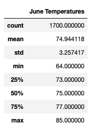
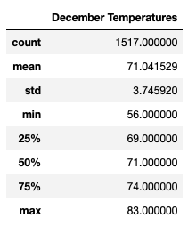

# Surfs Up
### Project Overview
In this project we are analyzing weather data for Oahu Hawaii in order to see if it would be a good idea to open a surf and ice cream shop there. We are looking to provide strong evidence to investor W. Avy that the weather there is great for a new surf shop and that it will do well based on the analysis of weather data.
### Goals
Analyze weather data from multiple weather stations, create visualizations, charts and graphs to provide evidence and assurance to our investor, W. Avy.
### Technologies Used
- Jupyter Notebook
- Python 3
- Visual Studio Code Editor
- ZSH terminal
- Github
- Google Chrome
- Flask

Dependencies

- %matplotlib inline
- matplotlib
- numpy
- pandas
- datetime
- sqlalchemy
- automap_base
- session
- create_engine
- func
- extract

### Challenge Summary
W. Avy likes your analysis, but he wants more information about temperature trends before opening the surf shop. Specifically, he wants temperature data for the months of June and December in Oahu, in order to determine if the surf and ice cream shop business is sustainable year-round.

Using Python, Pandas functions and methods, and SQLAlchemy, you’ll filter the date column of the Measurements table in the hawaii.sqlite database to retrieve all the temperatures for the month of June. You’ll then convert those temperatures to a list, create a DataFrame from the list, and generate the summary statistics.

### Tasks
- Determine the Summary Statistics for June
- Determine the Summary Statistics for December
- A written report for the statistical analysis

To provide a further analysis I would not only look into temperatures but also weather conditions maybe create a table or dictionary of those data correlations. I would also run furher queries on January Temperatures and also a query for temperatures of all the years each individually and as a whole. I believe that would really seal the deal if there is any missin peices or even if there are some hidden faults in the original analysis that we did not catch because we did not analyze enough.

### Results

As shown in the images above, the average temperatures do not differ much but of only about 4 degrees. The difference in the total count of temperatures between both data sets may or may not be a huge contributing factor to the average temperatures. If both counts were even, would it create a significant drop in the average of temperatures or bring them closer together.

The min temperatures differ the most between both data sets. Maybe it would be best to create bins for the ranges of temperatures and sort the data that way. We can then generate the counts of the data by temperature ranges and get a clearer idea on how many days of the year do we have good weather and how many days do we have bad weather.